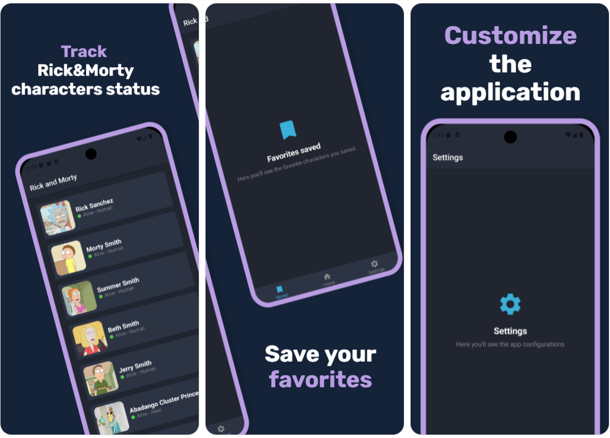

# [パコニ](https://github.com/0spol/Pakoni) · [](https://github.com/0spol/Pakoni/blob/main/LICENSE)
A modular Android project using Clean Architecture with Kotlin and Gradle.

This project integrates a Rick and Morty's api for data.
It demonstrates practices with modularization, separation of concerns, and dependency injection.

# Screenshots


# Features
- Clean Architecture modularization
- Integration with [Rick and Morty API](https://rickandmortyapi.com)
- Dependency Injection with Hilt
- Room
- Jetpack components

# Architecture
The proyect follows the [official architecture guidance](https://developer.android.com/topic/architecture).

# Setup
1. Clone the repository:
   ```bash
   git clone https://github.com/0spol/pakoni.git
   ```
2. Open in Android Studio.
3. Sync Gradle dependencies.
4. Run the app on an emulator or device.

# Contributing
Read our [contributing guide](./CONTRIBUTING.md) to learn about our development process, how to propose bugfixes and improvements, and how to build and test your changes.

## Code of Conduct
This repository has adopted a Code of Conduct that we expect project participants to adhere to. Please read [the full text](./CODE_OF_CONDUCT.md) so that you can understand what actions will and will not be tolerated.

# License
This project is licensed under the [Apache 2.0](./LICENSE.md).
